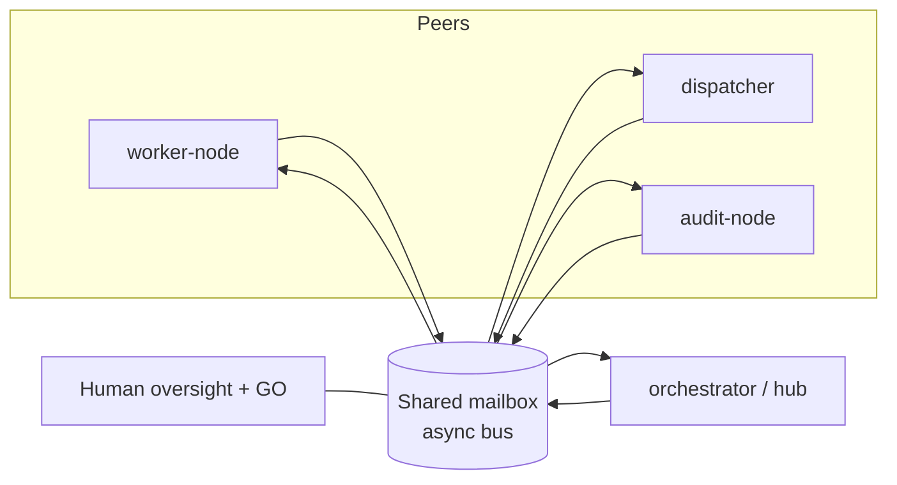
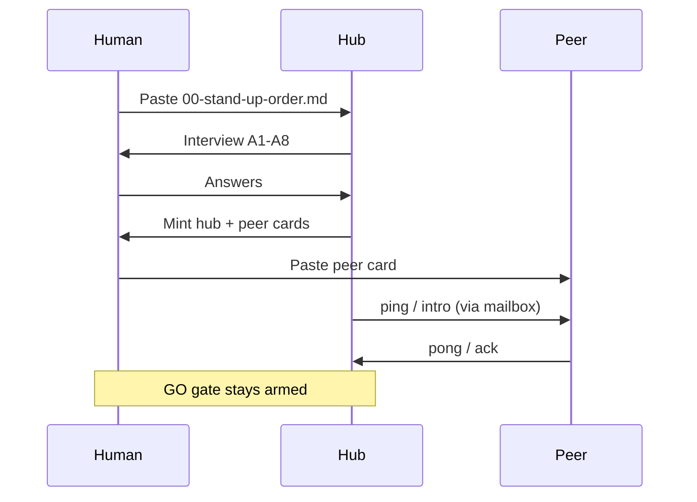
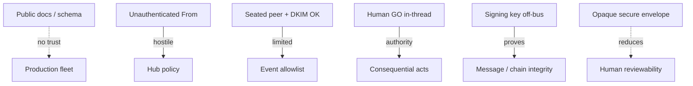

# Diagram: CATBus architecture

```mermaid
flowchart LR
  subgraph peers [Peers]
    W[worker-node]
    D[dispatcher]
    A[audit-node]
  end
  M[(Shared mailbox\nasync bus)]
  H[orchestrator / hub]
  U[Human oversight + GO]
  W --> M
  D --> M
  A --> M
  H --> M
  M --> H
  M --> W
  M --> D
  M --> A
  U --- M
```

## Deploy path (design lock)

```mermaid
sequenceDiagram
  participant Human
  participant Hub
  participant Peer
  Human->>Hub: Paste 00-stand-up-order.md
  Hub->>Human: Interview A1-A8
  Human->>Hub: Answers
  Hub->>Human: Mint hub + peer cards
  Human->>Peer: Paste peer card
  Hub->>Peer: ping / intro (via mailbox)
  Peer->>Hub: pong / ack
  Note over Human,Hub: GO gate stays armed
```

## Trust sketch

```mermaid
flowchart TB
  Pub[Public docs / schema] -.->|no trust| Fleet[Production fleet]
  Ext[Unauthenticated From] -->|hostile| Policy[Hub policy]
  Seat[Seated peer + DKIM OK] -->|limited| Allow[Event allowlist]
  GO[Human GO in-thread] -->|authority| Acts[Consequential acts]
  Key[Signing key off-bus] -->|proves| Integrity[Message / chain integrity]
  Opaque[Opaque secure envelope] -.->|reduces| Review[Human reviewability]
```
