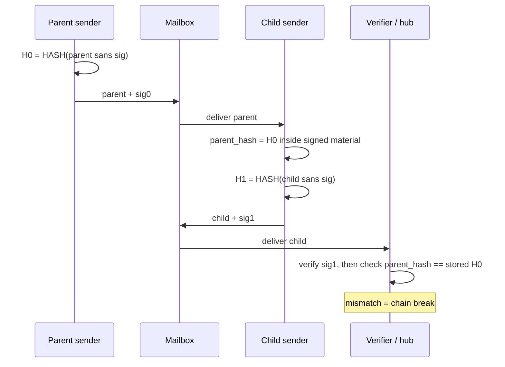
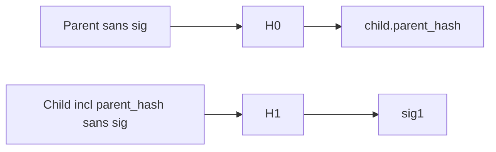

# Diagram: signing chain (hash-into-hash)

Signing is **OPTIONAL** and **recommended** for seated machine traffic. See [`../signing.md`](../signing.md).

```mermaid
sequenceDiagram
  participant P as Parent sender
  participant Bus as Mailbox
  participant C as Child sender
  participant V as Verifier / hub
  P->>P: H0 = HASH(parent sans sig)
  P->>Bus: parent + sig0
  Bus->>C: deliver parent
  C->>C: parent_hash = H0 inside signed material
  C->>C: H1 = HASH(child sans sig)
  C->>Bus: child + sig1
  Bus->>V: deliver child
  V->>V: verify sig1, then check parent_hash == stored H0
  Note over V: mismatch = chain break
```

```mermaid
flowchart LR
  E0[Parent sans sig] --> H0[H0]
  H0 --> PH[child.parent_hash]
  E1[Child incl parent_hash sans sig] --> H1[H1]
  H1 --> S1[sig1]
```
